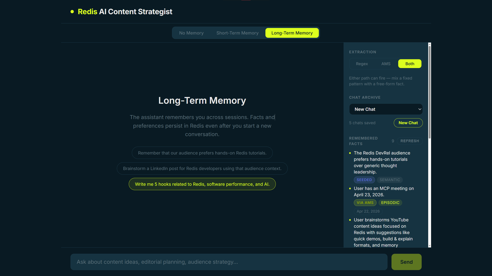

# Redis Memory Demo

[](https://fastapi.tiangolo.com/)
[](https://react.dev/)
[](https://redis.io/)
[](https://docs.docker.com/compose/)

LLMs are stateless. Every request starts from zero with no memory of who you are, what you said, or what matters to you. This demo shows how Redis changes that by giving an AI assistant **short-term** and **long-term** memory, turning a forgetful chatbot into one that actually learns.



## The Journey

This demo walks through three stages of memory:

**1. No Memory** - The assistant has zero context. Ask it your name twice and it won't remember. This is the default LLM experience.

**2. Short-Term Memory** - Redis stores the conversation history for the current session. The assistant can reference earlier messages, but everything disappears when the session ends.

**3. Long-Term Memory** - Redis persists facts about you across sessions. The assistant knows your name, your preferences, and your history, even in a brand new conversation. Facts are extracted two ways:
  - **Regex** - Instant, deterministic pattern matching for common phrases like "my name is..." or "Remember that..."
  - **AMS (Agent Memory Server)** - LLM-powered extraction that understands freeform language, runs discretely in the background

## Quick Start

### Prerequisites

- Docker Desktop (running)
- [Redis Insight](https://redis.io/insight/) (for inspecting stored memory and vector data)
- [Anthropic API key](https://console.anthropic.com/) (for chat-bot interactions)
- [OpenAI API key](https://platform.openai.com/api-keys) (for AMS embeddings and extraction)

### Setup

```bash
cp .env.example .env
```

Open `.env` and fill in your two API keys:

| Variable | Purpose |
|----------|---------|
| `ANTHROPIC_API_KEY` | Powers the Claude chat backend |
| `OPENAI_API_KEY` | Powers AMS: embeddings (`text-embedding-3-small`) and extraction models (`gpt-4o`, `gpt-4o-mini`) |

Everything else in `.env.example` has sensible defaults, image versions, model names, vector dimensions, etc. You shouldn't need to change them unless you want to swap models or tune behavior.

Then start the stack:

```bash
docker compose up --build
```

Find your ports:

```bash
docker compose ps
```

Open the frontend URL in your browser, which can be found in docker, and start chatting.

### Tear Down

```bash
docker compose down       # stop services
docker compose down -v    # stop + wipe all Redis data
```

## Memory Tutorial

Try these sample prompts in long-term mode with **Regex** extraction to see instant fact storage:

**Semantic** (timeless facts about identity and preferences):
- `My name is Matthew`
- `I prefer dark mode`
- `Remember that the deploy key rotates every 90 days`

**Episodic** (time-bound events tied to a specific date):
- `We shipped the new API on March 10`
- `I attended KubeCon on April 3`
- `Our next conference is RedisConf on June 15`

Switch to **AMS** extraction and say the same things in your own words to see how LLM-powered extraction handles freeform language.

Toggle between all three modes in the UI to see the difference in real time.

> The demo pre-loads a set of long-term memories on startup. To customize or remove them, edit `backend/seeds/devrel_long_term_memories.json` or delete them from the frontend.

## Architecture

```
┌─────────────┐         ┌──────────────────┐        ┌───────────────────────┐
│   Frontend  │  HTTP   │     Backend      │  SDK   │  Agent Memory Server  │
│  React/Nginx├────────►│     FastAPI      ├───────►│        (AMS)          │
│             │         │                  │        │  Async LLM extraction │
└─────────────┘         └───────┬──────────┘        └───────────┬───────────┘
                                │                               │
                                │  Anthropic API                │  OpenAI Embeddings
                                ▼                               │
                        ┌──────────────┐                        │
                        │    Claude    │                        │
                        │   (Haiku)    │                        │
                        └──────────────┘                        │
                                                                ▼
                                                      ┌─────────────────┐
                                                      │      Redis      │
                                                      │  JSON + Search  │
                                                      │                 │
                                                      │  Working Memory │
                                                      │  Long-Term Facts│
                                                      │  Vector Index   │
                                                      └─────────────────┘
```

**Data flow:**
1. User sends a message from the React frontend
2. Backend loads relevant memory from Redis (session history + long-term facts)
3. Claude generates a response with full context
4. The conversation turn is saved to working memory
5. Facts are extracted via regex (instant) and/or AMS (async, ~10s) and persisted to Redis

## Troubleshooting

| Problem | Fix |
|---------|-----|
| Chat fails but frontend loads | Check `ANTHROPIC_API_KEY` and `OPENAI_API_KEY` in `.env` |
| AMS extractions never appear | Verify AMS is healthy: `docker compose logs agent-memory-server` |
| Can't find the right port | Run `docker compose port frontend 80` |

## Tools and Resources

### AI Assistants

- **[Claude Opus 4.6](https://claude.ai/claude-code)** (Anthropic) - Primary coding assistant via Claude Code. Used for scaffolding, architecture, and documentation.
- **[ChatGPT 5.4](https://chatgpt.com)** (OpenAI) - Second perspective for brainstorming and reviewing approaches.

### Backend

- **[FastAPI](https://fastapi.tiangolo.com)** (v0.115.12) - Web framework for the API layer.
- **[Anthropic Python SDK](https://docs.anthropic.com/en/api/client-sdks)** (v0.94.0) - Client library for Claude.
- **[pydantic-settings](https://docs.pydantic.dev/latest/concepts/pydantic_settings/)** (v2.9.1) - Environment variable management.

### Frontend

- **[React](https://react.dev)** (v19.2.5) - UI library for the chat interface.
- **[Vite](https://vite.dev)** (v8.0.8) - Build tool with hot module reload.

### Infrastructure

- **[Docker Compose](https://docs.docker.com/compose/)** - Container orchestration for all four services.

### Redis Ecosystem

- **[Agent Memory Server (AMS)](https://github.com/redis/agent-memory-server)** - Manages working memory, long-term fact extraction, and semantic retrieval.
- **[RedisVL](https://github.com/redis/redis-vl-python)** - Vector similarity library used internally by AMS for embedding storage and search.
- **[Redis Insight](https://redis.io/insight/)** - GUI for browsing keys, inspecting stored memory, and viewing vector data in Redis.
